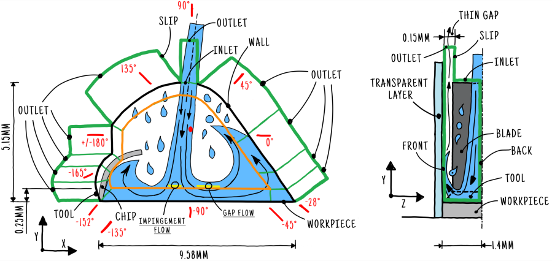

<a rel="license" href="http://creativecommons.org/licenses/by-sa/4.0/"></a><br />This work is licensed under a <a rel="license" href="http://creativecommons.org/licenses/by-sa/4.0/">Creative Commons Attribution-ShareAlike 4.0 International License</a>.

# Case for FLUSIMPRO - DFG 439925537

This is is the numerical setup for a narrow-closed cutting gap



## Prerequisites

- [OpenFOAM v2112](https://www.openfoam.com/news/main-news/openfoam-v2112)

- [gmsh 4.9.3](https://gitlab.onelab.info/gmsh/gmsh/-/tree/gmsh_4_9_3)

- [PyFoam](https://openfoamwiki.net/index.php/Contrib/PyFoam)

## Howto

Change to directory `nccg_ext` and execute:

```bash
sh makeMesh.sh .72k
```

This will create the case with the `72k` mesh. Run the simulation by executing

```bash
interFoam
```